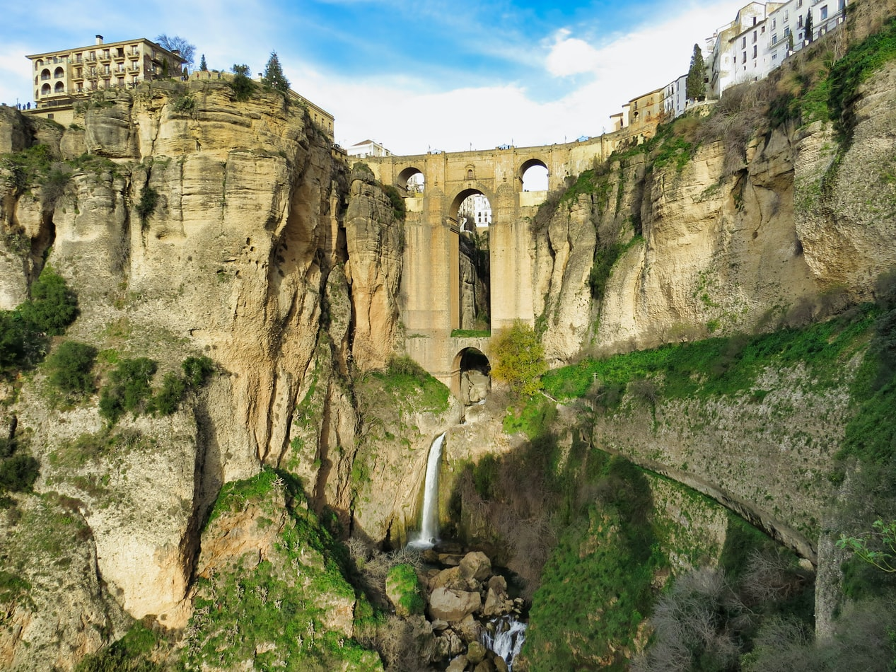

 
Jag är en stor Spanienfantast och därför är en av mina absoluta favoriter Torsten Grönwalls Spanien: en resa genom matens rike. Jag tycker han är väldigt intressant.

**Greta Larsson, Biblioteket i Focus**

Jättebra!!! En tung bok i alla bemärkelser.

**Stina Dahlberg**

En viktig kulturgärning.

**Pontus Persson, om böckerna i Spanienserien**

Torsten Grönwall beskriver förtjänstfullt hur den spanska demokratin byggdes upp. Gustafsson reder ut och intar den ambitiöse lärarens position.

**Olle Svensson**

En aktuell bok om dagens Spanien som hjälper oss alla att förstå det land vi är gäster i.

**Lars Göran Andersson**

Torsten Grönwall skildrar och analyserar det som nu händer i det krisdrabbade landet.

**Janne Bodin**

I Spanienkännaren Torsten Grönwalls nya aktuella bok ”Spanien – en resa genom matens rike” skildras och analyseras allt det som nu sker i Spanien.

**Kanarieliv**

en resa genom matens rike kommer säkert att fånga Spaniensvenskarnas intresse.

**Ola Josefsson**

Behandlar i detalj den nuvarande situationen i Spanien.

**Mats Björkman**

Hispanisten Torsten Grönwalls nya bok "Spanien - en färd genom historien" är en historisk fackbok ni inte ska missa... ¡Muy bien Torsten Grönwall!

**Alexander Hermansson**

Boken öppnar dörrarna för en djup och insatt kännedom om ett land, som innan läsningen ibland kan uppfattas som ytligt och kaotiskt. Boken kan både sträckläsas och användas som referensverk. I det senare fallet har man stor glädje att det utmärkta indexet i slutet, som hänvisar både på namn, årtal och termer.

**Jonas Grönberg**
