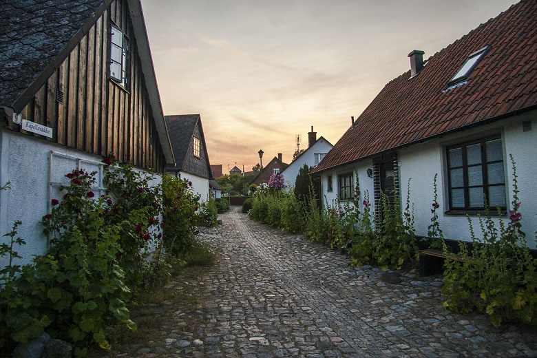

Hemma i Sverige så har man traditionellt lagt tak av tegel och till och av halm. Numera är det snarare plåt som gäller, och detta gäller i synnerhet i Helsingborg. Några som är riktiga fenor på att lägga just plåttak är [takläggare Helsingborg](https://www.xn--taklggarehelsingborg-ezb.nu/ "Takläggare Helsingborg"),
Helsingborg har en lång tradition av just plåttak som sträcker sig ända tillbaka till 1700-talet då borgmästaren Sture Sturesson tog hjälp av ryska arkitekter och dessa menade att plåttak var det bästa man kunde ha. Dock var ju övergången inte direkt smärtfri då det är en viss skillnad att lägga tegelpannor och nita fast plåtskivor.
Sedan blir det ju en helt annan aukustik som måste isoleras på helt andra sätt. 
Att man bara vågade ta steget mot något nytt! 

En ny sak är att man har börjat med växter på tak och fasader i staden, det låter väldigt spännande tycker jag. Du kan läsa mer om det [här](https://www.hd.se/2012-01-22/helsingborg-far-fler-grona-tak)