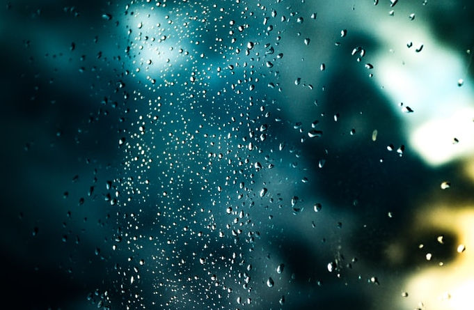

Ditt hem är din borg brukar det ju heta. Tidigare har vi diskutterat taken i husen och att dessa är kritiska att underhålla ordentligt. 
Något jag skulle vilja lägga till på denna lista är **fönster**, och vikten av att fönsterputsa dessa. Varför är detta så viktigt kanske du frågar dig? Jo, om du är som jag och bor i ett gammalt hus är det av yttersta vikt att underhålla fönstren då det förlänger livslängden på dessa avsevärt.
I värsta fall kan det bli så att fönstren slits ut redn efter 10 år, speciellt här nere i Skåne, där det blåser mycket. Platser som [Malmö](https://sv.wikipedia.org/wiki/Malm%C3%B6) är ju rena blåshålen, och med detta kommer det salt från haven, tillsammans med allt annat skräp som finns i luften och ansamlas på dina fönster, för att sedan rinna ner och tränga in i karmarna. Därför så bör man utföra fönsterputs ofta. Man bör även måla och kitta om fönstren var tredje år eller så.
Givetvis kan man putsa fönstren själv eller också anlitar man [företag som ägnar sig åt fönsterputs i tex Malmö](https://magdasfonsterputs.se/fonsterputsning-malmo/) men givetvis kan detta bolag också bidra med fönsterputs på andra orter, tex. Lund och [Kristianstad](https://magdasfonsterputs.se/fonsterputsning-kristianstad/).