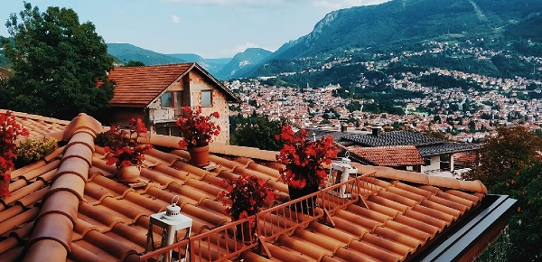

När det gäller hantverkare så skiljer sig Spanien från Sverige, rejält. Speciellt när man pratar om takläggare och snickare.
Takläggare i Halmstad gör absolut inte på samma sätt som grabbarna i Madrid. Madridborna gillar flata tak, och det är inget vi syslar med hemma i Svedala, på grund av snö och annat otyg.

Det gäller i och för sig att tänka på materialet även nere i Spanien då kvaliteten på cementen kan vara väldigt varierande. Sedan finns det gott om tivelaktiga aktörer, så man måste verkligen ha koll på leverantörerna och skriva ordentliga avtal, precis som hemma i Sverige med andra ord.

