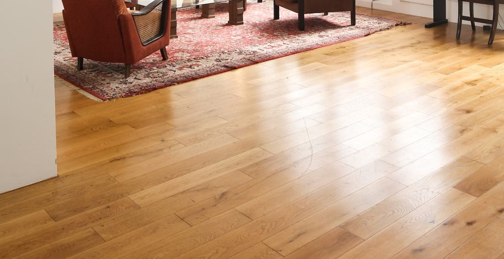

För att lägga golv hemma behöver man inte vara fullfjädrad snickare utan det räcker med att ha lite kunskap om hur man hanterar en del verktyg som såg, tumstock och sedan vara noggrann så att man gör rätt.  

Det första man gör är att se till så att den yta som det nya golvet ska ligga på är så jämn som möjligt och ren. Är det väldigt ojämnt kanske man behöver åtgärda det med golvspackel. Lister behöver eventuellt tas bort också och gör rent med dammsugare.  

Innan golvet börjar läggas ska man lägga dit underlagsfoam, denna brukar följa med i förpackningen med golvet. Det ska vara en slät yta och den är till för att minska så att stegen inte hörs så mycket ett så kallat stegskydd. Behöver man någon typ av isolering ska den även läggas ut nu.  

Börja sedan förbereda för hur golvet ska ligga, golvplankorna får inte ligga för nära väggen eftersom dom kan röra på sig med tanke på luftfuktighet. På de plankor som ligger längs med väggarna drar man bort ca 10 mm så att dom inte ligger för nära. Sedan ska golvplankorna sättas ihop genom att klicka ihop i varandra. Är det något problem att få ihop dom brukar det kunna lösas med hjälp av en hammare och klossbit.  

I princip är klickgolvet klart nu men sådant man behöver tänka på och som kräver lite mer arbete är vattenrör och dörrfoder. För vattenrör kan man mäta ut exakt vart rören ska sitta och sedan borra hålsåg ett lite större hål och sedan göra ett snitt längs hålen, sedan lägger du dit golvplankan vid hålen och passbiten på andra sidan. För dörrfoder kan man kapa det som behövs med en fogsvans, eler varför inte köpa en <a href="https://www.test.se/kap-och-gersag/" target="_blank" rel="nofollow">geringssåg</a>?  När jobbet är klart kan man börja sätta dit golvsocklar eller smyglister som man vill ha.  

Lycka till!
