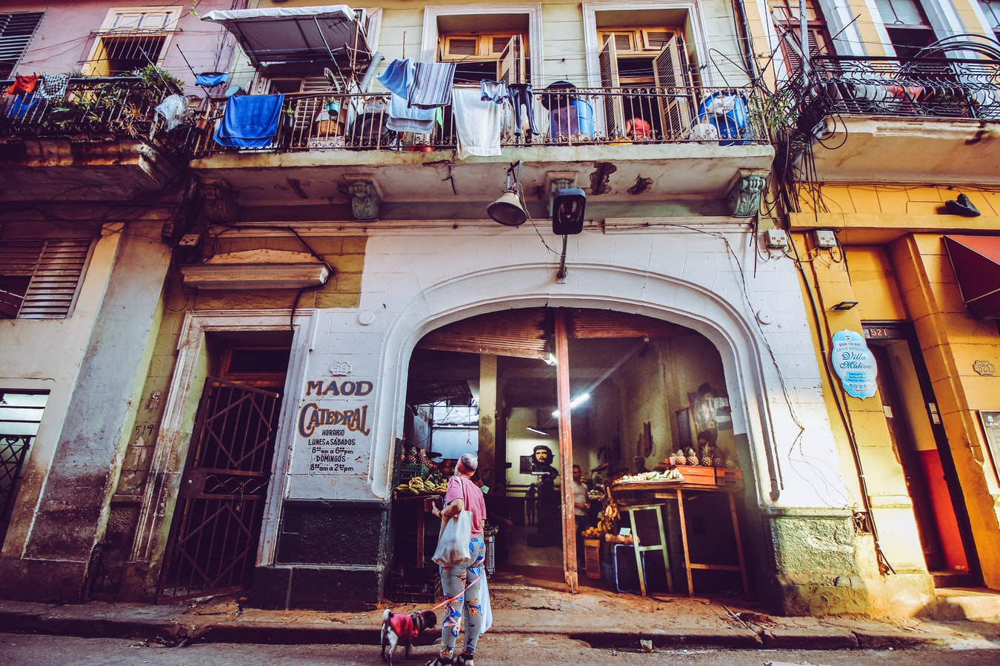

Här nedan finns adresserna till de klassiska hotellen och restaurangerna man inte bör missa i Havanna. Om man inte bor där eller äter där ska man i alla fall göra ett besök för att insupa stämningen. Här finns också förslag till en lång promenad som innefattar alla sevärdheter och museum man inte får missa om man är i Havanna.

## Klassiska hotell i Havanna ##

### Hotel Nacional de Cuba ###

Calle I y 21

Tel:+53-7-873 3564

Hotel Nacional är Havannas lyxigaste och mest välkända hotell. Efter invigningen 1930 blev det vallfärdsort för celibriteter, maffiabossar och höga dignitärer som kom från hela världen för att spela på casinot. Bland alla dem som bott på Nacional kan cigarrälskaren Winston Churchill nämnas. Efter revolutionen stängdes hotellet som ansågs vara kapitalismens högborg och byggnaden användes till bland annat lager. Efter smakfull renovering öppnades Nacional igen 1992. Lyxig pool och bakgrård. Det klassiska femstjärniga hotellet.

### Hotel Habana Libre ###

Calle L y 23

Tel:+53-7-554011

Habana Libre är mötesplatsen framför andra i Havanna. Här hade Fidel Castro länge en våning, här fick änkorna till Revolutionens hjältar ett rum, och här fattades i realiteten många av de första revolutionära besluten. Innan dörrarna öppnades för massturism var det hit man gick för att hyra bil, boka flyresor, skicka fax och få brev säkert postade. Hotellet fick dock förfalla och vid 1990-talets mitt var trafiken med prostituerade och fifflare i lobbyn så hektiskt att hela hotellet påminde om en bordell. 1996 övertog den spanska hotellkedja Tryp ansvaret och började renovera våning för våning. Swimingpool finns. Men för att vara femstjärnigt håller det enkel klass.

### Hotel Sevilla ###

Calle Trocadero 55

Tel: +53-7-860 8560

Sevilla är hotellet där diplomater och spioner brukade ta in i forna tider. Stängdes efter revolutionen. Efter Fidel Castros beslut att öppna landet för massturism kunde dock Sevilla öppnas igen 1994 efter renovering. Kakel från Sevilla och sydspansk arkitektur. På takvåningen en restaurang med fantastisk utsikt. Rum 501 har en egen historia, det var där Graham Green lät huvudpersonen i romanen ”Vår man i Havanna” invigas i spioneriets svåra konst. Fyra stjärnor. Det enda hotellet i gamla Havanna som har pool.

### Hotel Inglaterra ###

Prado 416

Tel: +53-7-8608594

Inglaterra är från 1875 och därmed Havannas äldsta hotell. Naturligtvis dryper väggarna av historia också här. Det är ingen slump att Inglaterra nämns av Graham Greene i romanen ”Vår man i Havanna”, författaren brukade själv bo här åren innan revolutionen liksom de flesta korrrespondenter som rapporterade om Batista-diktaurens fall. Cafeet var en livlig mötesplats för stadens intellektuella. Fortfarande är Inglaterra ett av Havannas charmigaste hotell och har en trevlig reception och hyfsad restaurang och ligger framför allt väldigt bra till för den som vill utforska gamla Havanna. Tre stjärnor, ingen pool.

### Hotel Ambos Mundos ###

Calle Obispo 153

Tel: +53-7-8609529

Ambos Mundos är berömt för att det var här, i rum 511, Ernest Hemingway skrev romanen ”Klockan klämtar för dig”. Hans andra äktenskap var på upphällningen och för att få skriva i lugn och ro, och kunna supa och åka ut på djuphavsfiske med grabbarna, lämnade författaren sin hustru i Kee West och åkte till Havanna. Hemingway trivdes så bra att han snart lämnade Florida för gott för att bosätta sig på Kuba. Innan renoveringen var hotellet ett prisvärt enkelt hotell men byggdes om och är nu sedan nyöppningen i februari 1997 ett fyrstjärnigt turisthotell. Hemingways rum har samtidigt gjorts om till museum.

### Casa Santa Brígida ###

Calle Oficios 204, entre Teniente Rey y Muralla

Tel: Tel: +53-7-866 4064

För den som vill bo på kloster finns nu Birgittaorderns gästhem i Havanna. I klostret finns bara elva rum. Det är ingen lyx men billigt. Birgittasystrarna är väldigt trevliga och vänliga och Sverige har en speciell plats i deras hjärta. Om man inte bor här kan man ändå göra ett besök för att se ett ”svenskt” kloster i Kuba.
 
## Klassiska restauranger och barer i Havanna ##

### La Bodeguita del Medio ###

Calle Empredado 206

Tel: 867 1374

Bodegan är en av Havannas mest berömda restauranger. Före revolutionen var detta stambar för Havannas författare, artister och andra bohemer och naturligtvis Ernest Hemingway. Serverar robust kreol-mat. Stället har bllivit en klassisk turistfälla och är alltid fullsatt. Men om ma inte vill äta här så är en mojito-drink i baren ett måste för alla havannabesökare.

### Restaurante Bar El Floridita ###

Calle Obispo 557, esq Calle Monserrate

El Fllodidita erbjuder internationellt kök samt fisk- och skaldjur. Men det är inte mmaten som lockar. Hit går man för att dricka en frozen daiquiri. Det var på Floridita denna drinkarnas drink en gång skapades. Stället som ligger i utkanten av Habana Vieja har blivit något av en turistfälla, men ett besök är ändå obligatoriskt.

### Casa Miglis ###

Lealtad No 120 entre Animas y Lagunas, Centro Habana

Tel +53(0)7-8641486 

www.casamiglis.com

Missa inte den svenska restaurangen i Havanna som är en mycket gott  resultat av Raúl Castros reformer. Sedan kravet om max tolv matplatser slopades och det blev tillåtet för privata restauranger att ha anställda har det dykt upp mängder med privata restauranger som är riktigt bra i Havanna. Svenske Michel Miglis kom till Kuba för att arbeta med musik och film men fastnade i landet. Eftersom det fanns restaurangtraditioner i familjen var steget inte långt att öppna en egen restaurang. Casa Miglis lyckas servera mycket god mat i ett land där det är svårt att hitta bra råvaror. Inredningen är läcker, och baren har gott utbud. För den som varit ett tag i Kuba är en Skagentoast som förrätt följd av en Biff Rydberg oemotståndlig.

### La Guarida ###

Calle Concordia No 418, entre Gervasi y Escobar

Stället ligger mitt i den myllrande Centro Habana och öppnades som en privatägd paladar men drivs nu av staten. Fast turisterna ska tro att allt är som vanligt. I filmen Choklad och jordgubbar utspelas en berömd scen här. Stället har besökts av alla möjliga kändisar från den latinska världen som drottning Sofia av Spanien och Pedro Almodóvar.

### Copelia ###

I mitten på ett litet parkområde mellan Calle 23 och Calle L, ett stenkast från Habana Libre
Detta är glassätarnas tempel i Havanna. Handlingen i Senel Paz roman ”Vargen, skogen och den nya människan” som sedan blev filmen ”Jordgubbe och choklad” kretsar kring Coppelia och huvudpersonernas funderingar över om de ska välja choklad eller jordgubbsglass. När Coppelia håller öppet ringlar alltid en lång kö utanför. Utlänningar som måste betala med konvertibla pesos går dock förbi den timslånga kön.

### Cabaret Tropicana ###

Calle 72 e 41 Y 45. i stadsdelen Marianao

Tropicana var den bästa och största nattklubben i världen när den öppnades 1931. Stället fick ha öppet under hela Revolutionen och hit bjöds alltid de sovjetiska partifunktionärerna efter förhandlingarna. All naken hud måste ha varit svårt att klara för många stalinister. Föreställningen är fortfarande vågad men absolut inga toppless eller plumphet utan dans och musik i toppklass. Det är dyrt att gå hit, men en middag här är närmast obligatorisk.

## Vad man inte får missa i Havanna ##
Under två dagar hinner man se det mesta som är värt att se i Havanna.
Havannas äldsta stadskärna är så unik att den 1982 förklarades tillhöra Mänsklighetens Kulturarv av FN-organet Unesco. Därmed är alla byggnader skyddade. Vissa delar han renoverats men förfallet inne på bakgator är stort.

En promenad genom Havanna börjar nere vid Plaza de la Catedral nere vid hamnen. Stanna till och titta på den gamla borgen Castillo de la Real Fuerza och fortsätt sedan uppp till Plaza de la Catedral där Katedralen är den stora attraktionen, den byggdes ursprungligen av jesuiter och stod klar 1724. Förr fanns Columbus kista i kyrkan, men 1899 krävde spanjorerna att få tillbaka sin store upptäckare. Fortsätt därefter ner till Plaza de Armas som är Havannas äldsta torg. Mitt på denna lummiga plaza som omges av gamla palats finns en staty av Carlos Manuel de Céspedes som inledde Kubas självständighetskamp mot spanjorerna. Gå Calle Oficios bort till Plaza Vieja och studera hur staden har renoverats. Ta en vätspeppaus på ett av caféerna här.

Återvänd till Plaza de Armas för att ta Calle Obispo upp som är renoverat och som skär rakt igenom gamla stan ända upp till Parque Central. Calle Obispo är en livlig gata som tar sin tid att passera. Mycket kommers. Mycket att se.

Slutligen når du fram till torget Parque Central som även det är värt att studera lite närmare, mitt på torget i skuggan av höga kungspalmer står statyn av revolutionshjälten Jose Marti. Här finns också en stor skara ynglingar och män varje eftermiddag som diskuterar baseboll och diskussionerna är mycket underhållande att följa även för den som inte vet något om den kubanska nationalsporten eller ens förstår spanska.
På andra sidan Parque Central ligger Havannas äldsta hotell Hotel Inglaterra, till vänster ligger Capitolio som är uppförd efter samma ritning som kongressen i Washington och fungerade som Kubas parlament fram till revolutionen då partipolitiken förbjöds, bakom Capitolio hittar man den gamla cigarrfabriken Fábrica de Tabacos Partágas som är öppen för allmänheten.

Efter en lunchpaus i Hotel Inglaterras restaurang söker sig revolutionsromantiker vidare till Jose Martis födelsehus Casa natal de José Martí som ligger tvärs över järnvägsstationen vilket betyder en taxiresa.

Den som strunar i José Martí tar sig i stället till fots längs Paseo del Prado ner mot havet. Nere vid havet viker man till höger för att gå till det gamla Presidentpalatset som numera är Revolutionsmuseet. Finns det en timme över kan man gå in på museet, här kan man se presidentens rum och på baksidan ligger Granma i en bur av glas (82 man med vapen fanns i den lilla motorbåten!) omgiven av vapen från revolutionen. Inne i museet finns fotografier och andra minnen från revolutionens första år.

Konstintresserade kan sedan passa på att besöka Museo Nacional de Bellas Artes, Kubas viktigaste konstmuseum, som ligger på andra sidan gatan. Men de flesta föredrar nog attt åka hem, ta en dusch och ladda inför kvällen.

Dagen efter tar man en taxi på morgonen och kommer överens om ett fast pris för en längre rundtur. Börja med att besöka Plaza de la Revolución, revolutionsplatsen, som pryds av en jättelik staty av Jose Marti. Medan taxin väntar kan man gå rut och titta på torget och ta bilder. Det är från tribunen under monumentet Fidel Castro brukar hålla sina tal till massorna. Runt torget ligger maktens boningar, i ett har El Comandante en Jefe sitt arbetsrum.

Efter Plaza de la Revolución fortsätter färden till Ernest Hemingways hus Finca la Vigía som ligger i förorten San Frasisco de Paula och taxiresan tar nästan en halvtimme. I trädgården ligger nobelpristagarens fiskbåt Pilar. Inne i huset finns allt bevarat som precis som det var när författaren levde. Pennorna på skrivbordet. Böcker och tidningar överallt. Till och med spriten i flaskorna väntar fortfarande på att bli upphälld av den törstige. Besökat klarar man av på en timme så det kan vara värt att låta taxin vänta.

När Finca Vigía är avklarat återvänder man mot centrum. Be taxin köra till Barrio Chino Centro, kineskvarteren, där man åter lunch på en av kinesrestaurangerna som ligger på Boulevar del Barrio Chino. Efter lunchen är det dags att undersöka Havannas centrum som numera är betydligt lugnare än i forna dagar. Det är här man lär känna havannaborna och se hur de lever. Vandra hela eftermiddagen genom Habana Viaja ochh Centro Habana, när orken tar slut är det dags att åka hem och ladda för kvällen.
 

