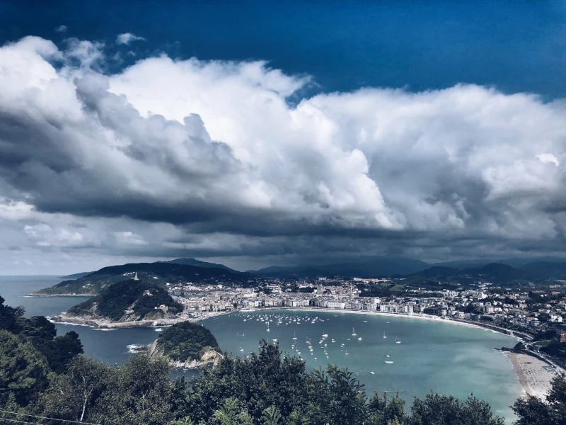

San Sebastian ligger i Baskien nära den franska gränsen. Hit kan man ta sig genom att flyga till San Sebastian, Bilbao eller Biarritz.  San Sebastian är en kuststad som ligger vid Atlantkusten. Under vår och höst är här höga vågor och det lockar till sig en mängd surfare. På sommaren är de breda stränderna fyllda av badgäster. Här nedan kommer några tips på vad man kan göra i San Sebastian.

**Pintxos**: är Baskiens typ av tapas och det finns mängder av olika varianter. San Sebastian är känt för att ha många restauranger med Michelin-stjärna. <a href="https://spainguides.com/gastronomy-of-spain/san-sebastian/" target="_blank">Här</a> kan du läsa mer om tips på var man kan äta i San Sebastian.

**Monte Igueldo**: är en kulle med utsikt över hela San Sebastian och bukten det ligger vid. Toppen av kullen kan man nå med spårvagn.

**Parte Vieja-Gamla stan**: här kan man gå i små gränder och titta på gamla stan. Stanna vid små barer, restauranger och butiker.

**Playa de la Concha**: strand mitt i staden med två dramatiska berg på vardera sidan. En lång och bred strand med fin sand. Här kan man sola och bada eller bara promenera.

**El Peine del Viento**: det är där staden slutar och vattnet börjar. Här har man satt tre stålskulpturer. Vinden och vågorna slår hårt mot stenar och skulpturer.

**Centro Romantico**: det är en nyare del av staden med många vackra byggnader och arkitektur. I denna charmiga del av staden kan du shoppa, dricka kaffe eller bara vandra runt.

**Monte Urgull**: Monte Urgull är den högsta punkten i San Sebastian, 123 m högt. Här finns t ex en Jesusstaty och den gamla fästningen Castillo de la Mota som byggdes av Kung Sancho VII av Navarra.
